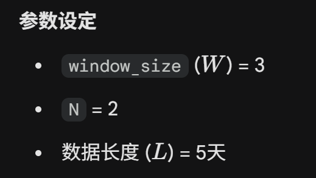
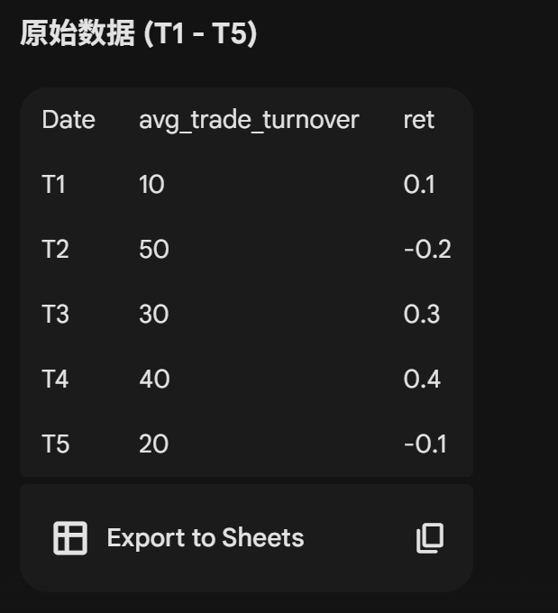
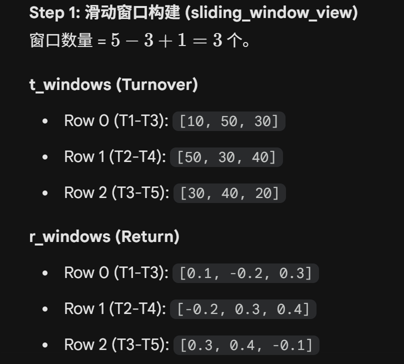
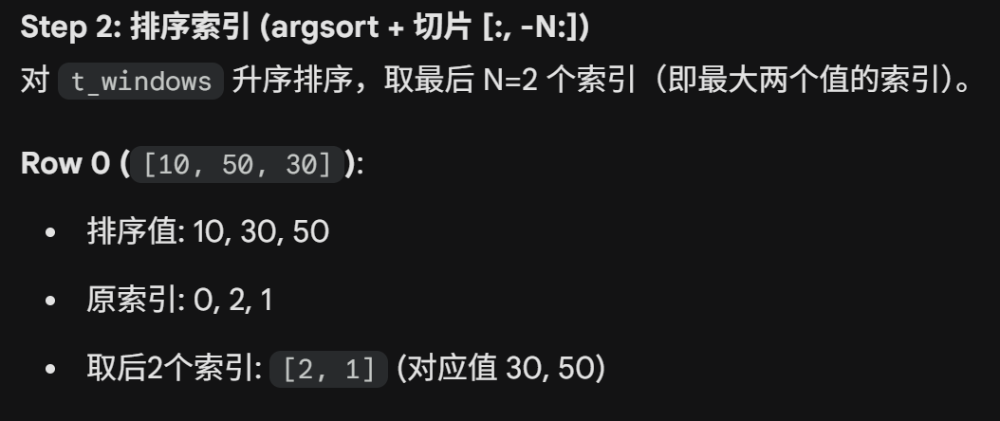
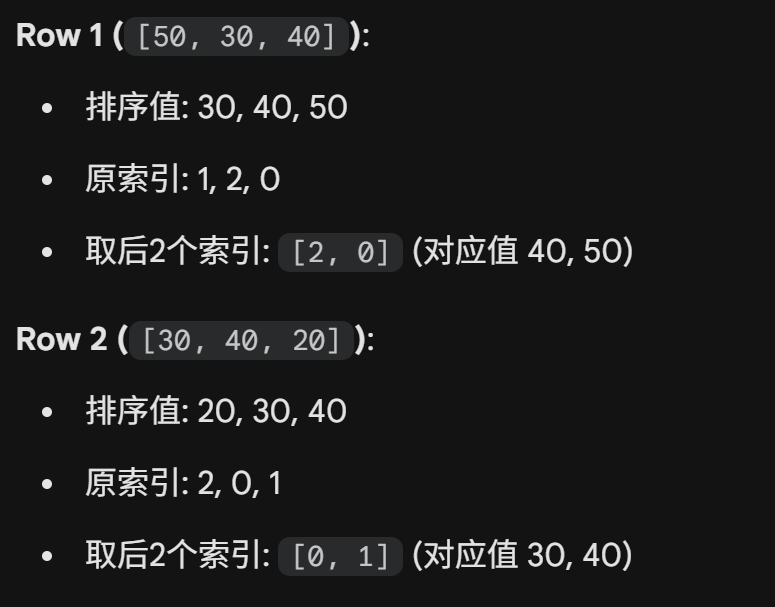
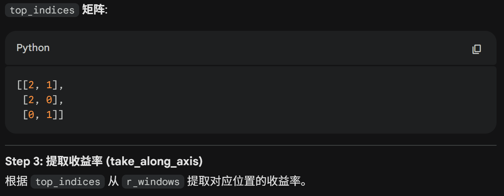
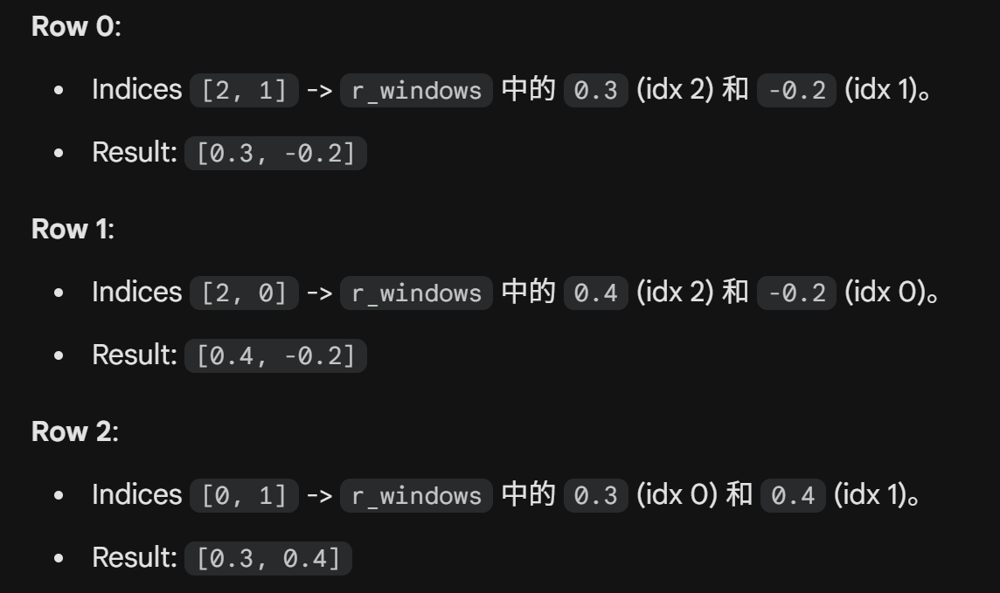
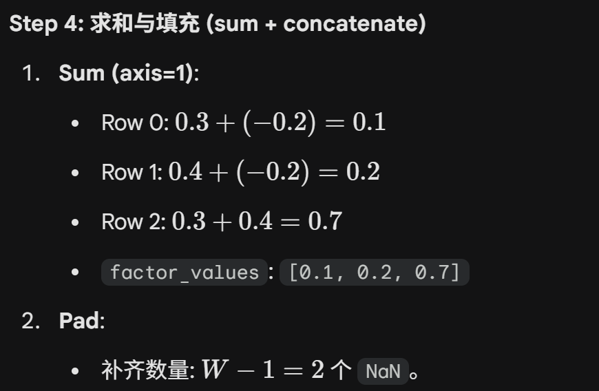
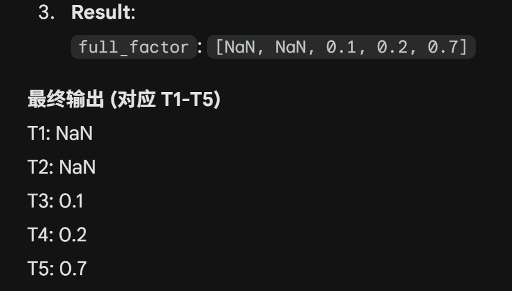

# STR (Salience Theory of Returns) 因子构建说明

## 1. 核心理论

显著性理论（Salience Theory）认为投资者会对“显著”的收益率产生过度反应。当一只股票的收益率在某些交易日显著偏离市场平均水平时，投资者会放大这些日子的权重，从而导致错误定价。

## 2. 构建步骤

### 第一步：计算单日显著性得分 (Salience Measure)

对于股票 $i$ 在第 $s$ 天的收益率 $r_{i,s}$，其相对于市场平均收益率 $\bar{r}_s$ 的显著性定义为：

$$
\sigma(r_{i,s}, \bar{r}_s) = \frac{|r_{i,s} - \bar{r}_s|}{|r_{i,s}| + |\bar{r}_s| + \theta}
$$

- **参数选择**：$\theta = 0.1$。
- **含义**：该指标捕捉了个股收益率与市场中枢的偏离度，分母起到平滑和消除量纲影响的作用。

### 第二步：确定显著性权重 (Salience Weights)

在回溯期（通常为过去一个月，约 20 个交易日）内：

1. 将每日的显著性得分 $\sigma$ 从大到小进行排序，得到排名 $k$。
2. 根据排名计算显著性权重 $\omega_k$：
   $$
   \omega_k = \frac{\delta^{k-1}}{\sum_{j=1}^{S} \delta^{j-1}}
   $$

- **参数选择**：$\delta = 0.7$。
- **含义**：越显著的日子（排名越前），权重越高。

### 第三步：计算 STR 因子值

因子值 $ST_{i,t}$ 为显著性加权后的收益率：

$$
ST_{i,t} = \sum_{s=1}^{S} \omega_s r_{i,s}
$$

或者使用论文中提到的协方差简化形式（显著性加权收益率与等权收益率之差）：

$$
ST_{i,t} = \sum_{s=1}^{S} (\omega_s - \frac{1}{S}) r_{i,s}
$$

## 3. 预测逻辑

- **反转效应**：高 $ST$ 值的股票由于投资者的过度反应，价格往往被高估，未来预期收益较低；低 $ST$ 值的股票则可能被低估。
- **测试周期**：通常使用月度频率进行调仓测试。

# M_high 因子

